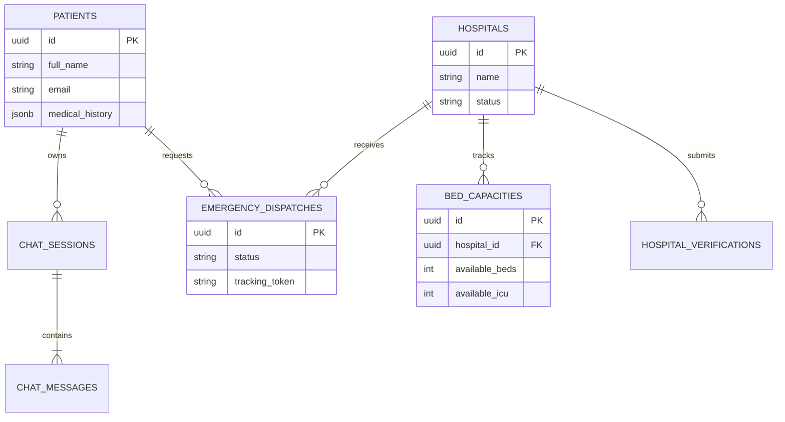

# 🏥⚡ HealthOS

> **Next-Generation Enterprise Health Operating System & Real-Time Emergency Intelligence Platform**

<p align="center">
  <a href="https://fastapi.tiangolo.com/"></a>
  <a href="https://react.dev/"></a>
  <a href="https://vitejs.dev/"></a>
  <a href="https://www.python.org/"></a>
  <a href="https://supabase.com/"></a>
  <a href="https://ai.google.dev/"></a>
</p>

---

## 📖 What is HealthOS?

**HealthOS** is a modular, enterprise-grade healthcare operating system. It was engineered to bridge the critical gaps between public emergency services, patient care management, hospital operations, and regional healthcare oversight. 

By combining high-performance backend frameworks with **Google Gemini 3.6 Flash AI**, HealthOS delivers:
* **Real-time situational awareness** for hospitals and authorities.
* **Predictive bed forecasting** to manage hospital load.
* **Automated emergency triage** that dispatches help instantly.
* **Clinical AI support** tailored securely to individual patient profiles.

---

## ✨ Core Modules & Features

### 🚑 Real-Time Emergency SOS 
* **1-Click Dispatch:** Immediate SOS requests from patients or public bystanders.
* **Live Public Tracking:** A secure, token-authenticated URL (`/emergency/track/:token`) allows families to watch ambulance dispatch and arrival in real-time.
* **Smart Intent Triggers:** The system scans chat queries for severe keywords (*e.g., chest pain, severe bleeding, anaphylaxis, unconscious*) and instantly surfaces high-priority Emergency Action Cards.

### 🤖 AI Clinical Assistant (Gemini 3.6 Flash)
* **Secure Server-Side AI:** Gemini API keys are never exposed to the browser.
* **Contextual Triage:** The AI dynamically reads patient metadata (age, allergies, active conditions) to provide highly personalized clinical guidance.
* **Local Fallback:** Gracefully degrades to a local clinical guidance mode if external LLM endpoints experience downtime.

### 🏥 Hospital Command Center
* **Capacity Forecaster:** Live dashboards tracking general beds, ICUs, ventilators, and oxygen, backed by predictive surge analytics.
* **Emergency Intake:** A live feed of inbound emergency dispatches and ambulance triage assignments.
* **Verification Workflow:** Streamlined onboarding for hospitals to upload accreditation and validate operational credentials.

### 🛡️ Regional Authority & 👤 Patient Portals
* **Authority Dashboard:** Allows regional supervisors to review hospital licenses, spot bed bottlenecks, and audit system security.
* **Patient Hub:** Centralized Electronic Health Records (EHR), virtual tele-triage scheduling, and active prescription tracking.

---

## 🏛️ System Architecture

HealthOS operates on a multi-tenant, role-based ecosystem connecting four distinct user environments:

```text
               +-------------------------------------------------------------+
               |                         HEALTH OS                           |
               |      Enterprise Healthcare Operating System Platform        |
               +------------------------------+------------------------------+
                                              |
      +-------------------+---------+---------+---------+-------------------+
      |                   |                   |                   |         |
      v                   v                   v                   v         v
┌───────────┐       ┌───────────┐       ┌───────────┐       ┌───────────┐ ┌───────────┐
│  Public   │       │  Patient  │       │ Hospital  │       │ Authority │ │    AI     │
│ Discovery │       │  Portal   │       │ Command   │       │   Admin   │ │  Engine   │
└───────────┘       └───────────┘       └───────────┘       └───────────┘ └───────────┘
```

---

## 🛠️ Tech Stack

| Layer | Technologies | Purpose |
| :--- | :--- | :--- |
| **Backend API** | Python 3.10+, FastAPI, Uvicorn | High-performance async REST framework |
| **Data & ORM** | SQLAlchemy 2.0, Pydantic v2 | Data validation and database interactions |
| **Frontend UI** | React 19, Vite 6.1, React Router v7 | Fast, modular Single Page Application |
| **Styling** | Custom CSS Tokens, Lucide Icons | Responsive, enterprise-grade glassmorphism |
| **Database** | Supabase PostgreSQL, SQLite3 | Scalable cloud storage with Row Level Security |
| **AI Engine** | Google Gemini 3.6 Flash | Clinical guidance and automated emergency detection |

---

## 🚀 Quick Start Guide

### 1. Prerequisites
Ensure your machine has the following installed:
* **Python**: `3.10` or higher
* **Node.js**: `18.0` or higher
* **npm**: `9.0` or higher

### 2. Environment Setup
Clone the repo and set up your base configuration files:
```bash
git clone https://github.com/Akash-314/HealthOS.git
cd HealthOS

# Copy environment templates
cp .env.example .env
cp backend/.env.example backend/.env
cp frontend/.env.example frontend/.env
```
*(Optional: Add your Supabase and Gemini credentials to `backend/.env` for full cloud functionality).*

### 3. Start the Backend (FastAPI)
```bash
cd backend
python -m venv venv

# Activate (Windows PowerShell):
.\venv\Scripts\Activate.ps1

# Activate (Mac/Linux):
source venv/bin/activate

pip install -r requirements.txt
uvicorn app.main:app --reload --port 8000
```
* **API Health Check:** `http://localhost:8000/api/v1/health`
* **Swagger UI:** `http://localhost:8000/docs`

### 4. Start the Frontend (React + Vite)
Open a new terminal window:
```bash
cd frontend
npm install
npm run dev
```
* **Web App:** `http://localhost:5173`

---

## 📡 Core API Endpoints

### 🩺 Health Check
```http
GET /api/v1/health
```
- **Response**: `{"status": "healthy", "service": "HealthOS API"}`

---

### 🤖 AI Medical Chatbot API
```http
POST /api/v1/chat
Content-Type: application/json
Authorization: Bearer <SUPABASE_JWT_TOKEN>
```

**Request Payload:**
```json
{
  "message": "I am having severe tightness in my chest.",
  "session_id": "9b1deb4d-3b7d-4bad-9bdd-2b0d7b3dcb6d",
  "context_bridge": {
    "age_bracket": "45-54",
    "known_allergies": ["Penicillin"]
  }
}
```

**Response Output:**
```json
{
  "success": true,
  "message": "⚠️ EMERGENCY WARNING: Chest tightness requires immediate evaluation...",
  "sessionId": "9b1deb4d-3b7d-4bad-9bdd-2b0d7b3dcb6d",
  "response": "⚠️ EMERGENCY WARNING: Chest tightness requires immediate evaluation...",
  "model": "gemini-3.6-flash",
  "service": "HealthOS Gemini Medical Assistant",
  "triage_level": "EMERGENCY",
  "disclaimer": "Informational guidance only. Not a medical diagnosis.",
  "emergency_action_required": true,
  "action_cards": [
    {
      "type": "EMERGENCY_SOS",
      "title": "Trigger HealthOS Emergency SOS",
      "action_route": "/patient/emergency"
    }
  ]
}
```

---

## 🗄️ Database Architecture

Built for multi-tenant isolation with UUID primary keys and strict audit timestamping.

If using Supabase, apply the migrations found in `supabase/migrations/` via the Supabase CLI (`supabase db push`).



---

## 🔒 Security & Compliance

* **Role-Based Access Control (RBAC):** UI routing is strictly governed by frontend Guards (`ProtectedRoute` & `RoleGuard`) ensuring isolation between `PATIENT`, `HOSPITAL`, and `ADMIN` views.
* **Session Ownership:** Backend validation guarantees users can only read and write to their securely assigned chat and medical sessions.
* **Clinical Safety Safeguards:** All AI responses carry automatic clinical disclaimers, and the system is hard-coded to bypass the AI and trigger emergency alerts when fatal symptoms are detected.

---

## 📂 Repository Layout

```text
HealthOS/
├── backend/               # FastAPI Microservice & AI Engine
│   ├── app/               # API routers, models, services, & core config
│   ├── tests/             # Backend test suite
│   └── requirements.txt   # Python dependencies
├── frontend/              # React + Vite Client Application
│   ├── src/               # UI components, features, pages, & services
│   └── package.json       # Node dependencies
├── supabase/              # Database Schema & Migrations
│   └── migrations/        # SQL DDL migration files (00001-00006)
├── docs/                  # Architecture & System ADRs
├── .env.example           # Environment template
└── README.md              # Project documentation
```

---

<p align="center">
  <b>HealthOS 🏥⚡ — Built for modern, scalable, and lifesaving healthcare systems.</b>
</p>

